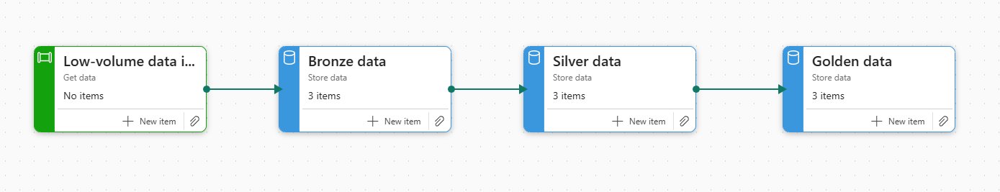

# EERSA Data Platform — Pipeline Medallion

Pipeline de ingeniería de datos end-to-end para los datos de generación eléctrica de **EERSA (Empresa Eléctrica Riobamba S.A.)** del año 2021, implementado con arquitectura Medallion (Bronze/Silver/Gold) sobre Microsoft Fabric.

El proyecto procesa 12 archivos Excel mensuales con registros diarios de generación por planta (Alao, Río Blanco, Nizag, Sistema Nacional Interconectado) y los convierte en tablas analíticas listas para BI y reportes regulatorios ARCERNNR.

---

## Arquitectura



```
12 archivos .xlsx
       ↓
   BRONZE      →  Datos crudos tal como llegan + metadatos de ingesta
       ↓
   SILVER      →  Limpieza, tipificación, deduplicación, clasificación de fuentes
       ↓
   GOLD        →  Modelado dimensional + agregados de negocio listos para BI
```

| Capa | Tablas | Filas | Función |
|------|--------|-------|---------|
| **Bronze** | `bronze_generacion_diaria` | 7,695 | Captura raw + linaje |
| **Silver** | `silver_generacion_diaria` + `silver_generacion_quarantine` | 5,840 | Conformación + quality gates |
| **Gold** | `gold_dim_planta`, `gold_fct_generacion_diaria`, `gold_agg_generacion_mensual`, `gold_agg_balance_energetico_mensual` | 1,825 + 36 + 12 | Modelo dimensional Kimball |

---

## Stack

- **Microsoft Fabric** — Lakehouses (OneLake), Notebooks PySpark, Delta Lake
- **PySpark** — transformaciones distribuidas
- **Delta Lake** — formato de tabla con ACID, time travel, schema evolution
- **Python + pandas + openpyxl** — extracción inicial de Excel
- **VS Code + GitHub** — desarrollo y versionamiento

---

## Estructura del repositorio

```
eersa-data-plataform/
├── notebooks/
│   ├── nb_bronze_generacion_eersa.ipynb    # Ingesta Excel → Bronze
│   ├── nb_silver_generacion_eersa.ipynb    # Bronze → Silver (limpieza)
│   └── nb_gold_generacion_eersa.ipynb      # Silver → Gold (modelado)
├── src/
│   ├── extractors/
│   │   └── eersa_generacion_extractor.py   # Versión local del extractor
│   ├── transformations/
│   ├── quality/
│   └── utils/
├── data/
│   ├── raw/         # 12 archivos .xlsx originales (no versionados)
│   ├── bronze/      # Parquet generado localmente
│   ├── silver/
│   └── gold/
├── configs/
│   └── sources.yml  # Metadatos de fuentes
├── docs/
│   └── imagenes/    # Screenshots del task flow y notebooks
├── dbt/
├── dags/
├── tests/
├── requirements.txt
├── Makefile
└── README.md
```

---

## Decisiones técnicas clave

### Bronze
- Carga **todo** sin filtrar — política de seguro para reprocesamiento
- Metadatos de linaje en cada fila: `_source_file`, `_ingested_at`, `_batch_id`
- Formato long (fecha × planta × métrica) para tolerancia a evolución de esquema
- Particionado mensual (`year`, `month`)

### Silver
- **Filtrado de métricas válidas** — descarta columnas basura del Excel original (`Unnamed`, `KWh.1`, `KWh.2`)
- **Normalización de nombres** — unifica `E.Neta Kwh` y `E.Neta kWh` (inconsistencia de mayúsculas)
- **Casteo seguro** — los valores no numéricos (ej. `'DM'`) van a tabla de cuarentena, no se descartan silenciosamente
- **Clasificación de fuente** — distingue `generacion_propia` (Alao, Río Blanco, Nizag) de `interconexion` (S.N.I.) y `agregado` (Total EERSA). Sin esta distinción, los analistas duplicarían energía
- **Deduplicación con window function** sobre `(fecha, planta, metrica)` quedándose con el registro más reciente
- **Schema enforcement** explícito (`Date`, `String`, `Double`, `Integer`)
- **Linaje completo**: `_bronze_ingested_at` + `_silver_processed_at`

### Gold
- **Modelo dimensional Kimball**: `dim_planta` + `fct_generacion_diaria` + agregados
- **Pivot wide** en hechos diarios para consumo directo desde Power BI
- **KPIs pre-calculados**: factor de carga mensual, demanda máxima/promedio, energía neta total
- **Balance energético mensual**: separa generación propia vs interconexión vs total

---

## Resultados

### Métricas del pipeline

| Etapa | Filas | Notas |
|-------|-------|-------|
| Excel crudo | 12 archivos × ~57 filas | Headers multinivel, celdas combinadas, ruido |
| Bronze | 7,695 | Captura completa con metadatos |
| Silver | 5,840 | 24% del ruido descartado, datos conformados |
| Gold (hechos) | 1,825 | Una fila por día × planta |
| Gold (mensual) | 36 | 3 plantas × 12 meses |
| Gold (balance) | 12 | Un registro mensual del año 2021 |

### Hallazgos del negocio

- **Generación propia EERSA 2021**: entre 5.3 y 8.5 GWh mensuales
- **Mes pico**: octubre 2021 (8,483 MWh)
- **Mes valle**: junio 2021 (5,338 MWh)
- **Plantas activas**: Alao (hidroeléctrica, ~10 MW), Río Blanco (~3 MW), Nizag (~1 MW)

---

## Cómo correr el pipeline

### En Microsoft Fabric

1. Importar los 3 notebooks al workspace de Fabric
2. Crear 3 Lakehouses: `lh_bronze_eersa`, `lh_silver_eersa`, `lh_gold_eersa`
3. Subir los 12 archivos `.xlsx` a `lh_bronze_eersa/Files/raw_eersa_generacion_2021/`
4. Ejecutar en orden: `nb_bronze` → `nb_silver` → `nb_gold`

### Localmente (versión Python)

```bash
# Setup
python -m venv .venv
.venv\Scripts\activate         # Windows
pip install -r requirements.txt

# Ejecutar extractor Bronze local
python -m src.extractors.eersa_generacion_extractor
```

---

## Próximos pasos

- [ ] Dashboard Power BI conectado a `gold_*`
- [ ] Pipeline de orquestación con Data Factory en Fabric
- [ ] Tests automáticos con Great Expectations
- [ ] Extender a múltiples años (2022-2025)
- [ ] Integrar datos de pérdidas técnicas y no técnicas
- [ ] Generación automática de formularios regulatorios ARCERNNR (TRA-040, TRA-060)

---
